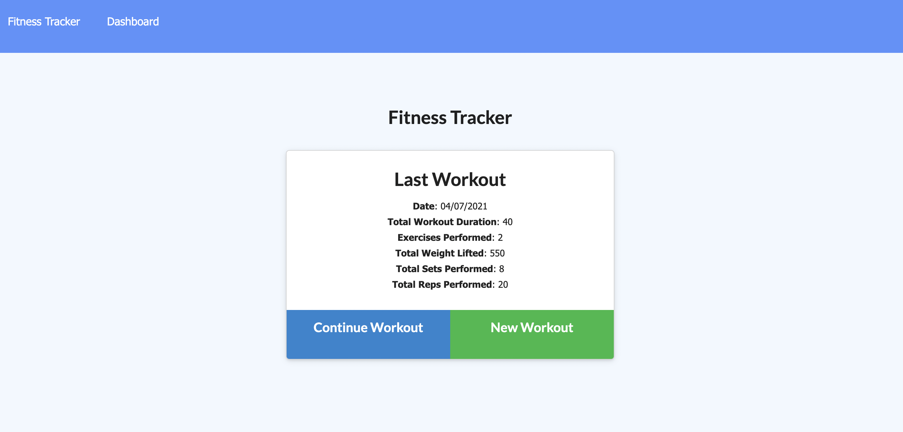
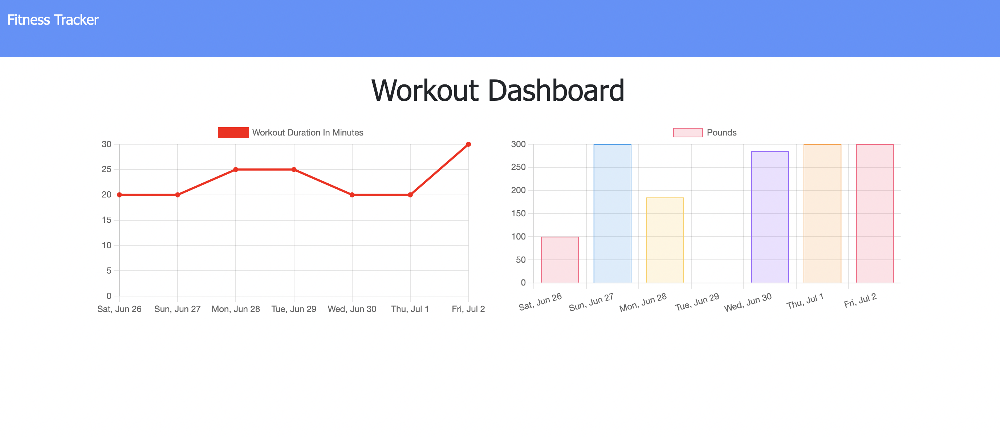
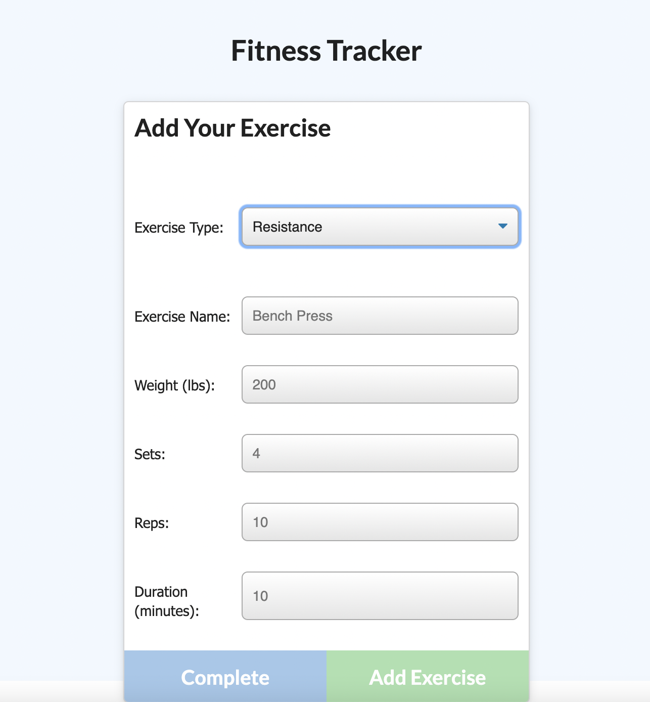

# Workout Tracker Application

 # Description

 This program allows you to keep track of your Fitness training.
 Especially with Covid breathing down your neck, it is so hard to stay motivated and inspired by exercise. This app makes it easy to keep track of your daily exercises so you can set goals for your fitness journey.
 You can add workouts each day with the different exercises you have completed. On the stats page, there are graphs tracking your daily activity so you can see your progress. If you like to complete workouts in small sessions, this program gives easy access to your latest workout so you can update it as you complete exercises. 

 # Table of Contents
 
 
 * [Useage](#useage)
 * [Contributing](#contributing)
 * [License](#license)
 * [Questions](#questions)

 # Useage
 This site is deployed at https://fitness-online-tracker.herokuapp.com/
 
 
 
 
 
 
 
 
 

 # Contributing
 Created by Madeleine O'Dea
 

 # License
  Licensed under MIT. 
  For more information, visit this link. 
  https://opensource.org/licenses/MIT
  
  
# Questions
For more examples of my work, please visit my GitHub at [madsterest](https://github.com/madsterest)
or contact me at
odea.madeleine@gmail.com
